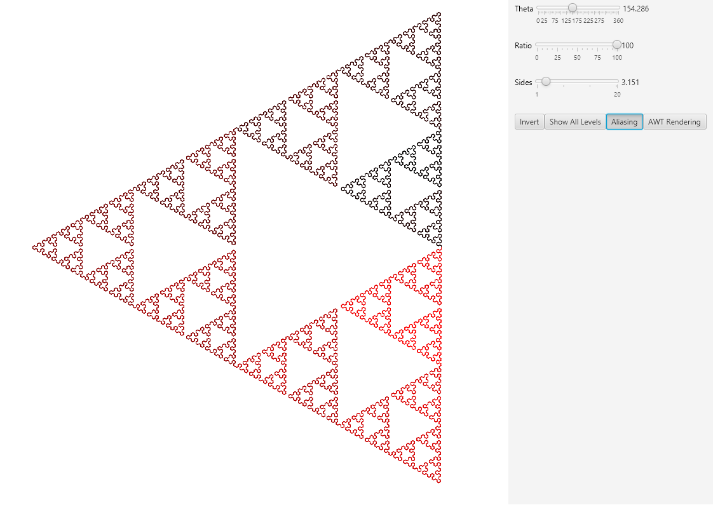

# CFractal

Generate simple [line based geometric fractals](https://www.stsci.edu/~lbradley/seminar/fractals.html#:~:text=A%20one%20dimensional%20line%20segment,of%20half%20the%20original%20length).) using an OK looking GUI and controls. 

## Running

```
mvn clean package
java -jar target/cfractal-1.0-SNAPSHOT.jar
```

## Controls

TODO

## Examples

### Sierpinski Triangle

There's more than a single way to construct some fractals. For example, the [Sierpinski Triangle](https://en.wikipedia.org/wiki/Sierpi%C5%84ski_triangle). 


